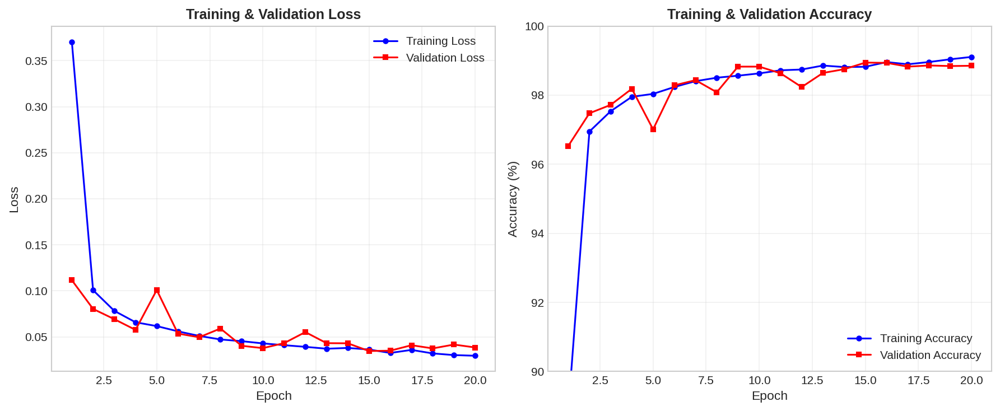
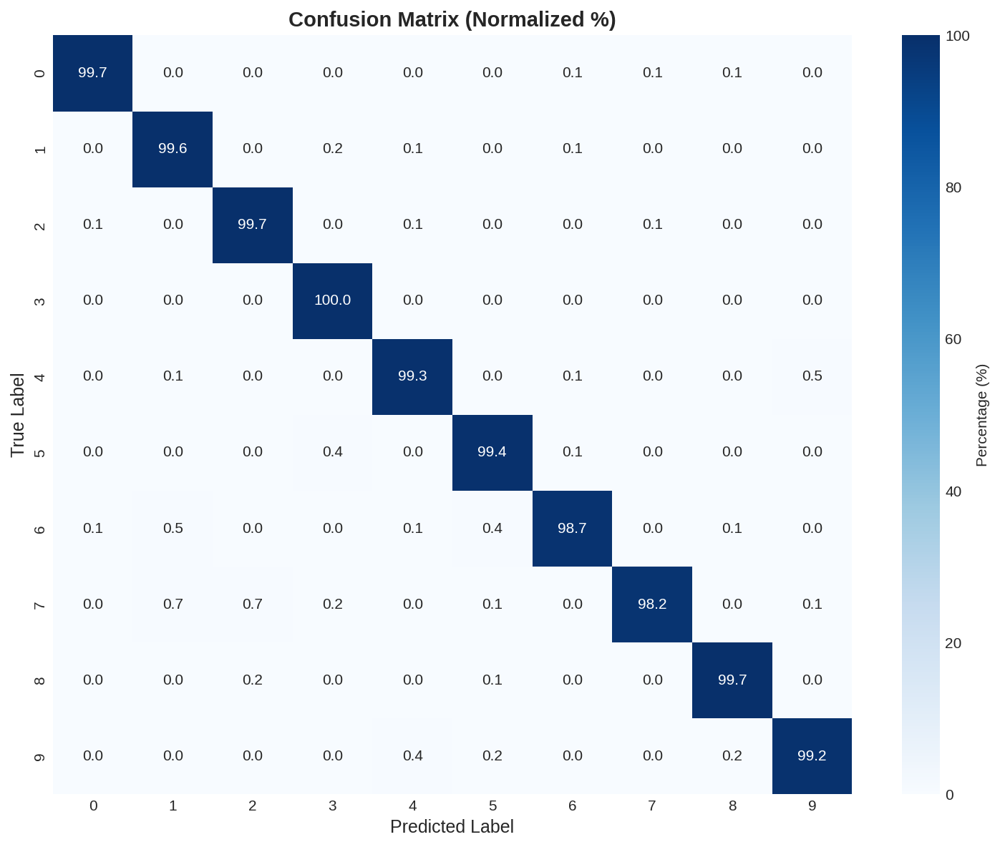
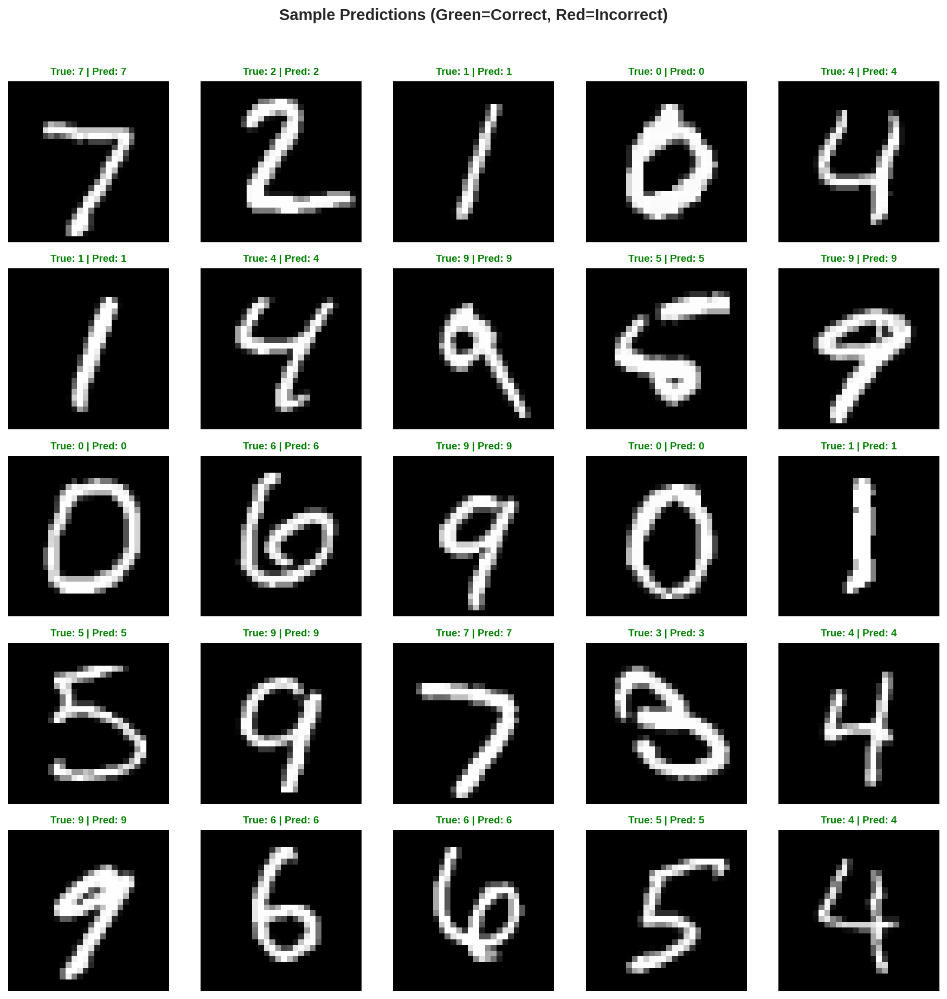

# MNIST Digit Recognition with PyTorch

A deep learning approach to handwritten digit recognition using Convolutional Neural Networks (CNNs). Built with modern Python practices including type hints, modular architecture, and comprehensive documentation.


---

## 📊 Results

| Metric | Value |
|--------|-------|
| **Test Accuracy** | 99.37% |
| **Precision** | 99.38% |
| **Recall** | 99.37% |
| **F1 Score** | 99.37% |

### Training & Validation Curves

<p align="center">
  
</p>

### Confusion Matrix

<p align="center">
  
</p>

### Sample Predictions

<p align="center">
  
</p>

---

## 🏗️ Model Architecture

```
ImprovedNet (422,474 parameters)
├── Conv2d(1, 32, 3x3) + BatchNorm + ReLU + MaxPool
├── Conv2d(32, 64, 3x3) + BatchNorm + ReLU + MaxPool  
├── Conv2d(64, 128, 3x3) + BatchNorm + ReLU + MaxPool
├── Flatten → 1152
├── Linear(1152, 256) + ReLU + Dropout(0.25)
├── Linear(256, 128) + ReLU
└── Linear(128, 10) → Output
```

**Also available:** `ResidualCNN` - A deeper architecture with skip connections for potentially higher accuracy.

---

## 🚀 Quick Start

### Prerequisites

- Python 3.8+
- CUDA-compatible GPU (optional, but recommended)

### Installation

```bash
# Clone the repository
git clone https://github.com/Mohamedhendawy312/MNIST-Handwritten-Digit-Recognition.git
cd MNIST-Handwritten-Digit-Recognition

# Create conda environment (recommended)
conda create -n mnist python=3.10 -y
conda activate mnist

# Install dependencies
pip install -r requirements.txt
```

### Training

```bash
# Train the model (downloads MNIST automatically)
python -m src.train
```

Training takes ~3 minutes on a modern GPU or ~10 minutes on CPU.

### Evaluation

```bash
# Evaluate on test set
python -m src.evaluate
```

### Generate Visualizations

```bash
# Generate confusion matrix, training curves, and sample predictions
python -m src.visualize
```

---

## 📁 Project Structure

```
MNIST-Handwritten-Digit-Recognition/
├── src/
│   ├── __init__.py       # Package exports
│   ├── config.py         # Configuration & hyperparameters
│   ├── model.py          # CNN architectures (ImprovedNet, ResidualCNN)
│   ├── utils.py          # Data loading & augmentation
│   ├── train.py          # Training pipeline
│   ├── evaluate.py       # Evaluation & metrics
│   └── visualize.py      # Visualization utilities
├── models/               # Saved model checkpoints
├── outputs/              # Generated visualizations
├── data/                 # MNIST data (auto-downloaded)
├── requirements.txt
├── .gitignore
└── README.md
```

---

## ⚙️ Configuration

All hyperparameters are centralized in `src/config.py`:

| Parameter | Default | Description |
|-----------|---------|-------------|
| `batch_size` | 128 | Training batch size |
| `learning_rate` | 0.001 | Initial learning rate |
| `epochs` | 20 | Number of training epochs |
| `dropout_rate` | 0.25 | Dropout for regularization |
| `model_name` | "improved" | Architecture ("improved" or "residual") |

### Using a Different Model

```python
from src.config import Config

config = Config(model_name="residual")  # Use ResidualCNN instead
```

---

## 📈 Data Augmentation

Training uses the following augmentations for better generalization:

- **Random Rotation**: ±10°
- **Random Affine**: Translation (±10%), Scale (0.9-1.1x)
- **Normalization**: Mean=0.1307, Std=0.3081 (MNIST statistics)

---

## 🛠️ Development

This project follows clean code conventions:

- ✅ Type hints throughout
- ✅ Google-style docstrings
- ✅ Modular architecture
- ✅ Reproducible (seeded random states)

---

## 📄 License

This project is licensed under the MIT License - see the [LICENSE](LICENSE) file for details.

---

## 👤 Author

**Mohamed Hendawy**

- GitHub: [@Mohamedhendawy312](https://github.com/Mohamedhendawy312)
- Email: mohamedhendawy312@gmail.com
